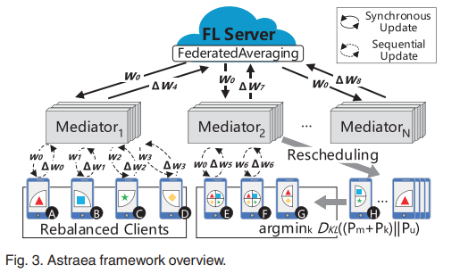

# Astraea
A unofficial yet simple implementation of TPDS'21 paper: [Self-Balancing Federated Learning With Global Imbalanced Data in Mobile Systems](https://scholar.google.com/scholar?cluster=9626415652765026586&hl=zh-CN&as_sdt=0,5), developed on November, 2020.

`Fork` & `Pull-Request` is welcomed.

